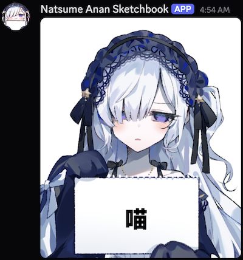

# Manosaba Discord Bot

A Discord bot for [Magical Girl Witch Trials (Manosaba)](https://store.steampowered.com/app/3101040/Magical_Girl_Witch_Trials/) that generates sketchbook images and in-game style dialogue images.



## Features

- **Sketchbook Command** (`/sketchbook`) - Generate sketchbook images with custom text, images, and 12 facial expressions
- **Dialogue Command** (`/dialogue`) - Generate in-game style dialogue images with 14 characters, 58 backgrounds, and customizable fonts

## Prerequisites

- Node.js 18.0.0+
- pnpm

## Installation

```bash
git clone https://github.com/yuna0x0/manosaba-discord-bot.git
cd manosaba-discord-bot
pnpm install
cp .env.example .env
```

Edit `.env` with your Discord credentials:

```
DISCORD_TOKEN=your_discord_bot_token
APPLICATION_ID=your_application_id
```

## Usage

Register commands with Discord:

```bash
pnpm register
```

Start the bot:

```bash
# Development
pnpm dev

# Production
pnpm build
pnpm start
```

## Commands

### `/sketchbook`

| Option | Required | Description |
|--------|----------|-------------|
| `text` | No* | Text to display |
| `image` | No* | Image to paste |
| `expression` | No | Facial expression (default: Normal, supports Random) |
| `align` | No | Horizontal alignment |
| `valign` | No | Vertical alignment |
| `overlay` | No | Apply overlay effect (default: true) |
| `wrap` | No | Text wrapping: Greedy or Knuth-Plass |
| `dm` | No | Send to DMs |

*At least one of `text` or `image` is required.

### `/dialogue`

| Option | Required | Description |
|--------|----------|-------------|
| `character` | Yes | Character to display |
| `expression` | Yes | Expression ID (autocomplete, supports Random) |
| `text` | Yes | Dialogue text |
| `background` | No | Background image ID (autocomplete) |
| `custom_background` | No | Upload custom background |
| `stretch` | No | Background fit mode |
| `font` | No | Font selection |
| `font_size` | No | Font size (24-120) |
| `highlight` | No | Highlight bracketed text |
| `language` | No | Character name language (default: ja) |
| `dm` | No | Send to DMs |

## Localization

Supports English, Traditional Chinese (zh-TW), Simplified Chinese (zh-CN), and Japanese (ja).

## License

MIT License - see [LICENSE](LICENSE) for details.

## Credits

- Sketchbook concept from [MarkCup-Official/Anan-s-Sketchbook-Chat-Box](https://github.com/MarkCup-Official/Anan-s-Sketchbook-Chat-Box)
- Dialogue concept from [oplivilqo/manosaba_text_box](https://github.com/oplivilqo/manosaba_text_box)

## Disclaimer

This project is for personal use and learning purposes only. Character assets belong to their respective copyright holders.
