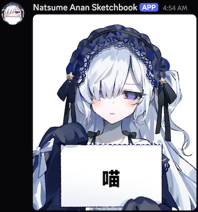

# Natsume Anan Sketchbook (Manosaba Discord Bot)

A Discord bot for [Magical Girl Witch Trials (Manosaba)](https://store.steampowered.com/app/3101040/Magical_Girl_Witch_Trials/) that generates sketchbook images and in-game style dialogue images.



## Features

- **Sketchbook Command** (`/sketchbook`) - Generate sketchbook images with custom text, images, and 12 facial expressions
- **Dialogue Command** (`/dialogue`) - Generate in-game style dialogue images with a choice of characters, expressions, and backgrounds
- **Post-generation editing** - ✏️ Adjust, ✨ Effects, and 🗑️ Delete buttons on every generated image (see [Adjust & Effects](#adjust--effects-after-generation))

## Prerequisites

- Node.js 22.13.0+
- pnpm 11

## Installation

```bash
git clone https://github.com/yuna0x0/anan-sketchbook-discord.git
cd anan-sketchbook-discord
pnpm install
cp .env.example .env
```

Edit `.env` with your Discord credentials:

```
DISCORD_TOKEN=your_discord_bot_token
APPLICATION_ID=your_application_id
```

## Usage

Register commands with Discord:

```bash
pnpm register
```

Start the bot:

```bash
# Development
pnpm dev

# Production
pnpm build
pnpm start
```

## Docker

### Using Docker Compose

```bash
# Register commands
docker compose run --rm register

# Build and start the bot
docker compose up -d

# View logs
docker compose logs -f

# Stop the bot
docker compose down
```

## Commands

### `/sketchbook`

| Option | Required | Description |
|--------|----------|-------------|
| `text` | No* | Text to display |
| `image` | No* | Image to paste |
| `expression` | No | Facial expression (default: Normal, supports Random) |
| `dm` | No | Send to DMs |
| `spoiler` | No | Mark the image as a spoiler (default: false) |

*At least one of `text` or `image` is required. Uploaded images are limited to 8 MB and 16 megapixels (configurable via `MAX_IMAGE_UPLOAD_MB` / `MAX_IMAGE_PIXELS_MP`).

### `/dialogue`

| Option | Required | Description |
|--------|----------|-------------|
| `character` | Yes | Character to display (autocomplete, scoped to the selected game) |
| `expression` | Yes | Expression ID (autocomplete, supports Random) |
| `text` | Yes | Dialogue text |
| `game` | No | Game to use characters and backgrounds from (default: Magical Girl Witch Trials) |
| `background` | No | Background image ID (autocomplete, scoped to the selected game) |
| `custom_background` | No | Upload custom background |
| `dm` | No | Send to DMs |
| `language` | No | Character name language (auto-detects from Discord locale, fallback per game) |
| `spoiler` | No | Mark the image as a spoiler (default: false) |

The dialogue system supports multiple games: each game contributes its own characters, backgrounds, dialogue box layout, and localizations. See [docs/adding-a-game.md](docs/adding-a-game.md) for how to add a new game.

### Adjust & Effects (after generation)

Adjust and Effects are usable by the command invoker; Delete also works for members with the Manage Messages permission.

- **✏️ Adjust** - text, expression, font, font size, plus text layout (sketchbook) or name language (dialogue)
- **✨ Effects** - image filter (paper texture / halftone / dithering / heatmap, inspired by [Paper Shaders](https://github.com/paper-design/shaders)), overlay & wrapping toggles (sketchbook) or background fit, background ID & bracket highlighting (dialogue), and a fine-tune field
- **🗑️** - delete the message

The fine-tune field takes space-separated `key=value` pairs covering both image adjustments and per-filter settings, e.g. `brightness=1.2 hue=90 dot_size=12`. Type `help` in the field to get this reference inside Discord (the rest of the modal still applies). Default options are marked in the modals, and clearing a field resets it to the defaults:

| Key | Range | Effect |
|-----|-------|--------|
| `brightness`, `contrast` | 0.1 to 3 | multiplier, 1 = unchanged |
| `saturation` | 0 to 5 | 0 = grayscale, 1 = unchanged |
| `hue` | -360 to 360 | hue rotation in degrees |
| `alpha` | 0 to 1 | transparency |
| `scale`, `scale_x`, `scale_y` | 0.1 to 2 | resize; per-axis keys stretch for meme effects |
| `rotate` | -360 to 360 | rotation in degrees |
| `blur` | 0.3 to 50 | gaussian blur |
| `sharpen` | 0.5 to 10 | sharpen |
| `tint` | RRGGBB or RRGGBBAA hex | color overlay, e.g. `tint=ff000066` for a red rage effect |
| `dot_size`, `dot_angle` | 4 to 24, 0 to 90 | halftone dot grid and screen angle |
| `px_size`, `color_steps` | 1 to 8, 2 to 8 | dithering pixel size and color levels |
| `grain` | 0.1 to 3 | paper texture intensity |

Numeric fine-tune options map to [sharp](https://sharp.pixelplumbing.com/) image operations. Submitting a modal re-renders the image in place. Editing sessions are kept in memory and expire after 24 hours of inactivity or on restart; the delete button works forever.

## Localization

Supports English, Traditional Chinese (zh-TW), Simplified Chinese (zh-CN), and Japanese (ja).

## License

The code is licensed under the MIT License - see [LICENSE](LICENSE) for details.

Character designs, sprites, and game-related assets are the property of Re,AER LLC./Acacia (Magical Girl Witch Trials / Manosaba) and are not covered by the MIT License. This Bot is a fan-made project and is not affiliated with or endorsed by Re,AER LLC./Acacia.

## Credits

- Sketchbook concept from [MarkCup-Official/Anan-s-Sketchbook-Chat-Box](https://github.com/MarkCup-Official/Anan-s-Sketchbook-Chat-Box)
- Dialogue concept from [oplivilqo/manosaba_text_box](https://github.com/oplivilqo/manosaba_text_box)
- Image filters (paper texture, halftone, dithering, heatmap) inspired by the image filters of [Paper Shaders](https://github.com/paper-design/shaders) by [Paper](https://paper.design) (Apache License 2.0). The CPU implementations in this project are original ports built on classic image-processing algorithms (ordered Bayer dithering, halftone screening, palette mapping, procedural paper grain) rather than translations of the GLSL sources.

